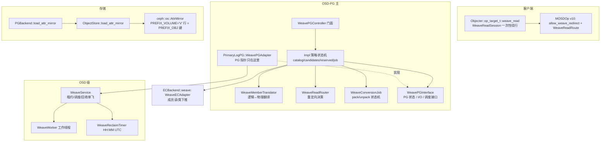
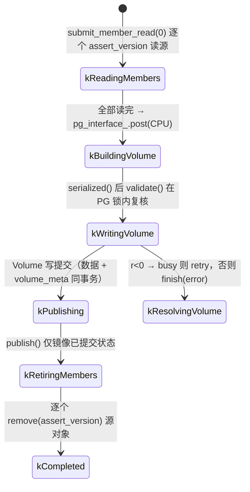

# Weave 代码级地图

适用分支：`feat/background-aggregate-ec`（结构说明依据提交 `c33178db7ed`，配置、命令及磁盘标识已同步到当前 weave 工作区；行号仅供定位参考）。
性质：**代码推导**文档。凡属设计文档的验收声明、真机复现结论，正文显式标注为「文档声明」。

## 0. 一句话语义

把同一 EC PG 内「稳定的普通小对象」按数据 shard 交错打包进一个 Volume 对象，对外保持逻辑对象身份；
读与 data-class 调用可重定向到成员所在的数据 shard 直读；写、快照、不支持的算子先反向物化回原生对象；
稀疏卷由清理任务回收。**落盘的 Volume 属性是权威，内存 Catalog 只是缓存。**

| 项 | 值 |
|---|---|
| 模块代码 | `src/osd/weave/` 23 个文件 4744 行（含 `detail/`） |
| 客户端接入 | `src/osdc/WeaveReadSession.h`、`src/osdc/Objecter.{h,cc}` |
| 存储层 | `src/os/AttrMirror.{h,cc}`、`src/os/bluestore/BlueStore.cc`（`V` 前缀） |
| 线上 | `MOSDOp`/`MOSDOpReply` v10 + `WEAVE_READ_REDIRECT`（bit 38） |
| 测试 | `src/test/weave/*`（3 个单测 TU + 静态门禁 + 2 个集成客户端 + 4 个集群脚本） |

## 1. 分层与文件职责



| 文件 | 行数 | 职责（关键符号） |
|---|---|---|
| `WeavePGController.{h,cc}` | 71/119 | 纯转发门面；`RequestDisposition`、`stops_native_processing`（`WeavePGController.h:15-35`） |
| `detail/WeavePGControllerImpl.{h,cc}` | 177/1018 | 准入策略、目录加载、候选、预留、任务编排、回收 |
| `WeavePGInterface.h` | 135 | PG 端口：`WeavePolicy/WeaveGeometry/WeaveObjectState`、`WeaveLease`、I/O 端口、`WeaveTransaction`；Ceph 不把 PG 指针交给策略层 |
| `WeavePGAdapter.cc` | 386 | `PrimaryLogPG::WeavePGAdapter`，唯一原生适配器 |
| `detail/WeaveConversionJob.{h,cc}` | 94/341 | 打包/物化状态机 |
| `detail/WeaveCatalog.{h,cc}` | 77/301 | 元数据 v1 编解码 + 双向内存索引，`shared_mutex` |
| `detail/WeaveMemberTranslator.{h,cc}` | 88/428 | 算子白名单、hobj/xattr/read/CALL 重写、回复还原、逻辑 STAT/版本 |
| `detail/WeaveReadRouter.{h,cc}` | 35/110 | 主侧 `redirect()` / 副本侧 `accept()` |
| `detail/WeaveLayout.h` | 100 | 私有位标志 + 交错布局 |
| `detail/WeaveXAttr.h` | 54 | 属性名、私有 namespace、xattr 前缀与载荷重建 |
| `detail/WeaveCandidateIndex.{h,cc}` | 90/212 | 有界候选集 + 选组算法 |
| `detail/WeaveWorker.{h,cc}` | — | 每 OSD 单工作线程：按用途分开的转换重试 + CPU 工作 + 租约槽 |
| `WeaveService.{h,cc}` | — | 每 OSD 服务：回收单飞、租约、转换重试 |
| `WeaveScanSchedule.h` | — | 每 PG 的候选检查定时、待执行任务去重与取消 |
| `detail/WeaveReclaimTimer.h` | 88 | 严格 `HH:MM` UTC 每日触发，含跨日/回拨高水位 |
| `WeaveECAdapter.{h,cc}` | 66/188 | EC 后端适配：成员 extent 换算、`decode_member`、data-class 执行 |
| `WeaveReadRoute.h` | 39 | 线上路由结构 |
| `detail/WeaveRequestContext.h` | 65 | 每请求的原始 oid、客户端算子模板、钉住的 Volume 元数据、sub-op 的 `ClsParmContext` |

## 2. 磁盘与线上格式

### 2.1 Volume 布局（shard 交错）

`slot_size = round_up(最大成员, unit)`（`WeavePGControllerImpl.cc:289-311` `plan_volume`）。成员 i 固定占用**数据 shard i**：

```
volume_offset(off, i) = (off / unit) * (k * unit) + i * unit + off % unit
```

见 `WeaveLayout.h:68-71`。`interleave_members`（`WeaveLayout.h:79-95`）按 unit 逐块写入成员切片、不足补零，并要求 `slot_size % unit == 0`、成员长度 ≤ slot；切片走 `substr_of/claim_append`，不复制 payload。物化侧用同一公式反取（`WeaveConversionJob.cc:272-299` `extract_member`）。

推论：一个 Volume 的 slot 是「所有成员共享的等宽槽」，padding 由 `osd_weave_max_padding_percent` 约束（见 §4.2）。

### 2.2 元数据 v1（当前布局，唯一可解码版本）

```
WeaveMemberMeta { uint8 shard; uint64 size; utime_t mtime;
                  version_t user_version; snapid_t snap_sequence; }
WeaveVolumeMeta { hobject_t volume_oid; uint32 data_shards; uint64 slot_size;
                  map<hobject_t, WeaveMemberMeta> members; }
```

`WeaveCatalog.h:15-40`；`ENCODE_START(1,1)`（`WeaveCatalog.cc:53-63`），解码只接受 `struct_v == 1`：`DECODE_START(1, p)` 加显式 `struct_v != 1` 硬拒（`WeaveCatalog.cc:65-92`），并做完整语义校验：`0 < data_shards <= 256`、`slot_size > 0 && <= UINT64_MAX/data_shards`、`members.size() <= data_shards`、shard 不重复、`member.size <= slot_size`、成员 oid ≠ volume oid、无尾随字节（`WeaveCatalog.cc:11-29,94-108`）。

`snap_sequence` 记录打包时原生 head 的 `snapset.seq`，物化时回放给 `SnapContext`，保证「对象创建之前的快照看不到它」（`WeaveConversionJob.cc:52-60`、`PrimaryLogPG.cc:4295-4299`）。

#### 版本号的含义与历史

`v1` 是 Ceph denc 的**结构体版本**（`src/include/encoding.h:1332` `ENCODE_START(v, compat, bl)`）：`volume_meta` blob 的前 6 字节依次是 `struct_v`（1B）、`struct_compat`（1B）、`struct_len`（4B 小端），其后才是字段。当前编码是 `ENCODE_START(1, 1)`（`WeaveCatalog.cc:53-63`），读作「第一代 Weave 布局，且要求读者至少实现到 v1」。

| 版本 | 来源 | 现状 |
|---|---|---|
| v1 | 当前 `WeaveVolumeMeta`（含 `snap_sequence`）——Weave 格式的第一代 | 唯一可解码版本 |
| 同名前身（非本格式） | 旧聚合实现（`AggregateBuffer`/`AggregateVolume`/`AggregateChunk`，`c33178db7ed` 删除）把 `volume_t`/`chunk_t` 存进**同名**的 `volume_meta` 属性，二者都是 `ENCODE_START(1, 1)`（`c33178db7ed^` 的 `src/osd/osd_types.h:6826-6845`、`:7036-7057`）。结构与布局都不同，只是复用了属性名 | 不构成迁移来源，无兼容代码 |
| 历史编号（已废止） | 提交 `c33178db7ed`：编码端写 `ENCODE_START(4, 4)`，解码端接受 `struct_v ∈ [2,4]`，并用 `decode_legacy_member` 处理 v2/v3——v2 限定「每 shard 恰一成员」且无 `user_version`，v3 有 `user_version` 但无 `snap_sequence`（即台账所谓「以 Volume 快照序号兜底」的来源）；v1 与 ≥5 一律拒绝。对应两个单测 `BackgroundV2MembersReloadWithoutLogicalVersions`、`RejectsMissingMemberVersionWithoutReplacingPublishedVolume` 在本工作区（本次之前）已随 legacy 解码一并删除（131 → 129）。 | 本次把编码与解码统一为 **1**：编号 4 只是开发迭代计数，`4` 是唯一被写出过的值，2/3 仅存在于读取端 |

因此当前代码里**没有任何旧版本解析分支**——「只接受当前布局」由下面两道门直接表达：

1. `DECODE_START(1, p)`（`encoding.h:1442-1461`）：`struct_v >= compatv` 时才读 `struct_compat`，且当 `v(1) < struct_compat` 时抛 `malformed_input("old version")`；凡声明了更高最低兼容版本的 blob 都在此失败。
2. 显式 `if (struct_v != 1) throw malformed_input("unsupported Weave metadata version")`（`WeaveCatalog.cc:65-75`）：denc 默认会放行 `struct_v=3, compat=1` 这类**前向兼容**的版本，这一行把它也拒掉，使「只接受当前布局」双向成立。这是 fail-closed 语义，不是旧版本解析；`test_weave.cc` 的 `RejectsForeignCodecVersionAndTrailingData` 分别用 `{2,2}`（被第 1 道门拦）与 `{3,1}`（只被第 2 道门拦）钉住两者。

**2026-09-26 的编号变更**：`4 → 1` 只改了两个版本字节，字段布局不变，但等价于一次磁盘格式断代——此前由 `4` 版二进制写过的 `volume_meta` 现在不可解码（Catalog 解码失败 → 控制器 `-EIO` → 入口关闭），没有迁移路径；旧测试数据目录不可再读。

加载时 Controller 筛选私有 namespace 中的记录，保留实际来源对象；Catalog 在一次解码中验证完整载荷和 `volume_oid == source`，再检查成员归属并整体发布。`buffer::error` 或身份不匹配返回 `-EINVAL`，归属冲突返回 `-EEXIST`；控制器统一记为 `metadata_error_ = -EIO` 并关闭 translator，阻止损坏映射进入原生路径。原 Catalog 在失败时保持完整。

可辨识版本的方法：Volume 是普通 RADOS 对象（命名空间 `.ceph-internal-weave`），取其 `_volume_meta` 属性的第一个字节即 `struct_v`（当前为 `0x01`；2026-09-26 之前写出的为 `0x04`，现已不可解码）。

### 2.3 命名与属性

当前工作区只使用 weave 命名，不保留旧配置别名或管理命令。磁盘命名空间与成员属性前缀也已断代；旧测试数据不受支持，没有迁移或回退读取路径。

| 常量 | 值 | 位置 |
|---|---|---|
| `kVolumeMetaAttr` | `volume_meta`（Volume 内自有属性，成员元数据载体） | `WeaveXAttr.h:11-12` |
| `kVolumeMetaXattr` | `_volume_meta`（ObjectStore/onode 投影名，前导下划线） | `WeaveXAttr.h:15-16` |
| `kVolumeNamespace` | `.ceph-internal-weave` | `WeaveXAttr.h:19-20` |
| 成员属性前缀 | `"weave." + oid.to_str() + "."` | `WeaveXAttr.h:20-27` |

打包时每个成员属性加前缀后合并进 Volume 属性集合（`WeaveConversionJob.cc:171-193` `compose_volume`），元数据以 `volume_meta` 与数据**同一对象事务**写入（`submit_volume_write`，`WeaveConversionJob.cc:195-219`）。

客户端可见的 xattr 名映射：PG 把 onode 属性投影为「下划线 + 名字」，所以用户看到 `volume_meta`/用户自定义名，存储层看到 `_volume_meta`/`_<name>`；逻辑成员读时物理键为 `weave.<oid>.` 前缀，回复再剥掉前缀（`WeaveMemberTranslator.cc:210-216,368-393`；`PrimaryLogPG.cc:6564,6605,7736,7755`）。

### 2.4 BlueStore 属性镜像（Catalog 的可枚举副本）

BlueStore 持有一个轻量的 `ceph::os::AttrMirror`，构造时固定属性名与磁盘前缀：

```cpp
attr_mirror_("_volume_meta", PREFIX_VOLUME)  // PREFIX_VOLUME = "V"
```

- **写入**：保留 onode 属性和 `V` 副本，两者在同一个 RocksDB 事务中维护。`BlueStore::Onode::attr_mirrored` 是内存布尔状态，只有行存在时才发出删除，避免普通对象写入产生无用的 `rmkey`。更新、删除和重命名使用同一个 `record` 方法，克隆沿用普通属性复制。
- **挂载**：索引从对象创建起持续维护；没有 bootstrap、完成 marker 或旧库迁移路径。挂载不扫描 `O` 重建缺失的 `V` 行，不支持由未维护索引的旧实现写入的数据。
- **读取**：`load_attr_mirror` 按 collection 的 key 区间扫描 `V`，只接受 `generation == NO_GEN && snap == CEPH_NOSNAP && pool >= 0` 的 head。接口链为 `PGBackend` → `ObjectStore` → `BlueStore`；不支持该接口的后端返回 `-EOPNOTSUPP`。
- **维护面**：组件只处理原始属性字节和对象 key，不解析 Weave 元数据。没有多镜像配置表、Port 回调集合、镜像位分配或重建版本管理。重复归属、冲突裁决仍由 Catalog/Controller 负责。

### 2.5 私有位标志（`OSDOp::op.flags`）

| 位 | 名称 | 含义 |
|---|---|---|
| `1<<29` | `kInternalIo` | 服务端物理 Objecter 子请求标记 |
| `1<<30` | `kMemberReconstruct` | 成员读需要整 chunk 重建 |
| `1<<31` | `kMemberRead` | 偏移/长度是**成员 shard 坐标** |
| `0xff<<16` | `kMemberIdMask` | 成员序号（逻辑 shard i） |

`WeaveLayout.h:41-66`。`store_read_flags()` 在落 ObjectStore 前剥掉这些位（`ECBackend.cc:912,1204,1219`），`consume_internal_ops` 在原生 OSD 看到算子前再剥一次并拒绝残留的 `CEPH_OSD_OP_EC_CALL`（`WeavePGControllerImpl.cc:573-586`）。OSD op flag 在 `rados.h` 只占低 9 位，16-23/29-31 空闲。

### 2.6 线上路由

```c
struct WeaveReadRoute {           // src/osd/weave/WeaveReadRoute.h:10-37
  hobject_t volume;               // 物理 Volume（nspace = .ceph-internal-weave）
  pg_shard_t target;              // 拥有该成员数据 shard 的 osd+shard
  epoch_t map_epoch;              // 签发时的 osdmap epoch
  eversion_t version;             // 签发时 Volume 的 object_info_t::version
};
```

注释明确它是**提示而非授权**，接收方必须用自己磁盘上的 Volume 元数据复核。`ENCODE_START(1,1)`。

挂载在 `MOSDOp`/`MOSDOpReply` version 10，且两端都以特性位门控：

```c
header.version = (HAVE_FEATURE(features, WEAVE_READ_REDIRECT) &&
                  HAVE_FEATURE(features, SERVER_QUINCY)) ? 10 : 8;
```

`MOSDOp.h:381-382,409-411,582-585`；`MOSDOpReply.h:201-202,233,266`。`WEAVE_READ_REDIRECT = bit 38`（`src/include/ceph_features.h:141`，已并入 `CEPH_FEATURES_ALL`）。请求侧另有 `weave_redirect_allowed` 布尔。

## 3. 打包（Pack）

`WeaveConversionJob::Mode` 在构造时明确指定 `kPack` 或 `kUnpack`，并在任务
生命周期内保持不变；`Stage` 只记录执行进度。两个方向都使用 `members`，
不按成员数量推断方向；空成员的解包任务直接删除 Volume。



### 3.1 候选登记与准入

- `on_commit` → `refresh_candidate`：Volume 私有对象永不入候选；已有映射的对象会被剔除（`WeavePGControllerImpl.cc:851-897`）。
- `eligible()` 只排除原生截断历史无法表达的对象：`truncate_seq == 0 && truncate_size == 0`（`WeaveCandidateIndex.h:35-38`，对应台账 I6）。
- Volume 大小上限复用 `osd_max_object_size` 和 `osd_max_write_size`（后者单位 MiB，0 表示不限），并受 32 位编码长度限制；没有独立的 Weave 大小配置。提交前按数据、属性名及属性值精确检查请求载荷，超限返回 `-EFBIG`。下一次 PG 候选检查会观察系统上限变化。
- 容量上界 `kMaxCandidates = 4096`；`configure()` 推导每 slot 上限 `(max_volume_size/k/unit)*unit`，配置收紧时立即 `prune_inadmissible()`（`WeaveCandidateIndex.cc:11-32`）。
- `upsert` 拒绝旧版本回放（`oi.version < 已有`），状态完全相同不重启 quiet 计时；改尺寸时先把排序节点 `extract` 出来再改（`WeaveCandidateIndex.cc:34-70`）。

### 3.2 选组算法

`select()`（`WeaveCandidateIndex.cc:83-181`）：沿按尺寸降序的 `by_size_` 扫描，维护一个 k 个指针的**环形窗口**与滚动和，当窗口满 k 时检查

```
volume_size * 100 <= sum * (padding_percent + 100)      // 128 位宽运算，不取整
```

满足即按窗口从最大成员起返回。逐条过滤：尺寸 ≥ `min_size`、≤ 每 slot 上限、`fits_slot`（padding 后仍 ≤ 上限）、quiet 期内未变更、`available()` 回调。

`select_packable` 额外要求：版本与候选记录一致、对象存在、仍 eligible、无 watcher、无 clone，且 `!object.blocks_pack()`（**共享读锁 `kReading` 允许，写锁/排队/阻塞为 `kBusy` 必须排除**）；不满足者进 stale 列表并从索引删除（`WeavePGControllerImpl.cc:262-286`）。

### 3.3 调度与唤醒

三个流程各有自己的入口，不再通过 `schedule_work()` / `run_scheduled_work()` 推测唤醒用途：

- **候选扫描**：前台 `on_commit()` 只更新候选及最后变更时间。启用 Weave 的主 PG 激活后，通过共享的 OSD `mono_timer` 定时投递 `PGWeaveScan`，在 `op_shardedwq` 的 `background_best_effort` 类别调度。定时器回调只投递任务；任务取得该 PG 的锁后，调用 Controller 的 `scan_candidates()` 选择、检查并尝试打包候选，再安排下一次检查。候选未冷却、不能配组或无并发槽时直接返回，等下一轮检查。有转换、清理或等待的前台请求时让出，不负责推进这些流程。读完成员后的 CPU 组装仍交给 Weave Worker。
- **前台物化**：请求准入立即尝试物化。若 Volume 忙或没有并发槽，`schedule_materialization_retry()` 只安排原始请求重新进入 PG 准入；已有转换时由该任务的完成回调交还请求。
- **清理**：`request_cleanup()` 直接进入 `resume_cleanup()`，一次转换完成后继续推进。Volume 忙、无并发槽或需要先交还前台请求时，`schedule_cleanup_retry()` 只继续本轮清理；角色或 clean 状态不再允许工作时结束本轮。

每个 PG 最多有一个待触发或排队中的检查；首次检查随机错开在间隔的 50%～100%，后续按 `osd_weave_scan_interval` 在上次检查结束后重新定时。PG 变化或关闭会取消定时并使已排队的旧任务失效；PG 不存在时任务直接丢弃。修改扫描间隔或后台开关会刷新 PG 定时，其他策略配置及 PG 转为 clean 由下一次检查观察。`scan_interval = 0` 使用 1 秒间隔，避免立即反复入队。候选索引的登记、重启恢复策略保持原样。

资源及转换失败仍使用 1 秒重试，与候选扫描间隔独立。Worker 以 `(pgid, WeaveRetryKind)` 保存回调，区分物化、清理及转换步骤，防止彼此覆盖。重试闭包持有 PG 引用并校验角色代数或任务 epoch；PG 变化取消全部重试。资源释放通知尚未接入，因此上述资源等待保留短周期重试。

### 3.4 提交与交付顺序

1. `pg_interface_->acquire()` 取 OSD 级租约：`osd_weave_max_concurrent` 为全局槽数，每 PG 仅一个槽（`WeaveWorker.cc:66-78`、`WeaveService.cc:91-101`）。
2. `plan_volume` 分配 Volume oid（`WeavePGAdapter.cc:129-140`，本地唯一名：`volume_<osd>_<pgid>_<epoch>_<tid>_<seq>`），并把 shard 顺序**在预留仍在时**固化进元数据。
3. `start_job` 先为每个成员写 `reserved_[oid] = identity`，再构造并启动 job（`WeavePGControllerImpl.cc:434-449`）。
4. 逐个成员 `read(oid, assert_version(user_version), size)`；短读直接失败（`WeaveConversionJob.cc:136-155`）。
5. CPU 组装（不带 PG 锁，`pg_interface_.post`）：`interleave_members` + 成员属性加前缀 + 编码 `volume_meta`（`:157-193`）。
6. 回到 PG 锁内（`pg_interface_.serialized`）调 `hooks_.validate()`：复核全部成员的预留身份、Catalog、exists、`blocks_pack()`、version、`snap_sequence`、eligible、watcher、clone（`job_is_valid`，`WeavePGControllerImpl.cc:465-484`）。
7. 写 Volume（`replace=false`）→ `pack_committed` → `hooks_.publish()`（仅 `catalog_.upsert`）→ 逐个删源，带 `assert_version` 防止删掉被改写过的对象，`-ENOENT` 视为已删（`WeaveConversionJob.cc:195-253`）。
8. `finish_job`：释放预留（失败时把源放回候选）→ `initialize()` **按磁盘强制重载**（打包失败也可能已提交但丢回调）→ 成功 requeue 等待者 / 失败 `fail_waiters`；打包路径失败还要 `translator_.shutdown()` 关闭请求入口（`WeavePGControllerImpl.cc:501-540`）。

一致性要点：**Volume 数据与有效 `volume_meta` 同事务提交即权威**；`publish`/`detach` 只是镜像已提交的磁盘变化，不含可回滚决策；回调丢失由磁盘裁决（台账 D1 的修复）。

崩溃注入点（`osd_weave_debug_crash_point`，`<checkpoint>:<index>`）：`pack_before_write`、`pack_committed`、`pack_published`、`source_before_remove`/`source_removed`、`member_before_write`/`member_written`、`volume_before_remove`/`volume_removed`、`volume_detached`（`WeavePGAdapter.cc:349-367`）。

## 4. 反向物化（Unpack）

### 4.1 触发判定

在 `preprocess_client_op` 内（`WeavePGControllerImpl.cc:789-830`）：

- `needs_native_transition`：快照访问、写（「纯尾部 DELETE」除外）、cache 操作、算子不在白名单（`:729-741`）。
- `is_logical_delete`：请求与池 `snap_sequence` 均为 0，末尾算子是 DELETE，且整组算子可翻译 → 直接缩映射，不物化（`:710-727`）。
- `drain_shadow_before_delete`：逻辑删除前先 `pg_interface_->wait_for_available`（unreadable/degraded）并确认没有遗留原生影子，否则延迟（`:743-756`）。
- `defer_for_materialization`：请求进 `waiting_for_conversion_`，必要时 `start_deaggregation`；删除的读屏障**不**因并发读修复而放宽（`:757-772`）。

### 4.2 流程

`read(volume, assert_version, size)` → `pg_interface_.post(materialize_members)`（CPU）→ `extract_member` 逐成员还原数据与属性 → `pg_interface_.serialized` → 逐个 `write(member, replace=true, mtime, assert/copy 版本)`，其中 `copy_version`/`copy_snap_sequence` 把 `user_version` 与原 `snapset.seq` 交还原生路径（`PrimaryLogPG.cc:9197-9202`、`4295-4299`，修 F1）→ 全部成员持久化后才 `remove(volume)` → 删卷提交后 `hooks_.detach()` 撤映射（`WeaveConversionJob.cc:255-340`）。

**Volume 删除事务是交还原生对象的提交点**：删除确认前不撤映射、不释放预留；空卷（成员为空）走同一路径但直接进入 `submit_volume_remove`（`:112-134`）。

### 4.3 回收（reclaim）

- 入口：`OSD::tick` 的每日定时器（`WeaveReclaimTimer.h`，严格 `HH:MM` UTC、跨日折叠、回拨不重放，`OSD::tick` `OSD.cc:6129`）与手工命令 `weave cleanup`（`OSD.cc:2544-2557`，注册于 `:3918`）。
- 单飞：`ReclaimPass` 弱引用 token，一轮未结束第二次请求返回 `already_running`（`WeaveService.cc:22-47,58-78`）；`snapshot()` 在 OSD 锁下取 dispatcher，随后逐个 PG 在自己的 PG 锁下执行（`OSD.cc:6099-6121`）。
- PG 内：请求时对 `catalog_.list_volumes()` 取快照，**空卷排前**（先回收容器再搬数据），每步对活 Catalog 复核；`volume_needs_reclaim`：`members * 100 <= data_shards * live_percent`（`WeavePGControllerImpl.cc:313-375`）。
- `start_deaggregation`：几何不匹配 → `-EIO` 并 `fail_waiters`；Volume 缺失 → `-ENOENT`；Volume busy 或无租约 → 下次唤醒重试（`:377-409`）。

## 5. 读路径（含 shard 直读重定向）

```mermaid
sequenceDiagram
  participant Cli as Client(Objecter)
  participant P as Primary OSD
  participant R as Replica(data shard)
  Cli->>P: MOSDOp(v10, allow_redirect, 逻辑 oid)
  P->>P: prepare_request → preprocess_client_op
  P->>P: translator_.translate(hobj=Volume, 成员 flags)
  P->>P: WeaveReadRouter::redirect → locate_read(acting[data_shard(member)])
  P-->>Cli: MOSDOpReply(-EAGAIN) + WeaveReadRoute
  Cli->>Cli: WeaveReadSession::redirect 一次性; _calc_target 改 osd/shard
  Cli->>R: 重放原 ops, allow_weave_redirect=false, 带 route
  R->>R: accept: eligible+route_is_local → 本地读 _volume_meta → 成员/定位/版本复核 → translate
  R-->>Cli: 数据（目标 shard 直读，或 decode_member 重建）
  Note over Cli,P: 任一步失败 → fallback() → 原生重试
```

### 5.1 主侧翻译

- `resolve_target`：身份优先取请求上下文里的原 oid，其次是 `catalog_.lookup()`；元数据存在但**列不出该成员**或几何不匹配时返回 `-EIO`，绝不回退原生路径（`WeaveMemberTranslator.cc:113-142`）。
- 算子白名单（`:60-122`）：`READ/SPARSE_READ/SYNC_READ/STAT/GETXATTRS/ASSERT_VER` 恒可；`DELETE` 仅当它是最后一个 sub-op；`GETXATTR/CMPXATTR` 校验 key/value 落在 `indata` 内；`CALL` 需类名在 `osd_weave_data_classes` 白名单内；其余 `-EOPNOTSUPP`。
- 重写（`:170-238`）：xattr 键加成员前缀并重建载荷；`GETXATTRS` 输入直接改成前缀；`STAT` 清空 outdata（回复时按元数据重编码）；`CALL` → `CEPH_OSD_OP_EC_CALL`，extent `0..member->size`，`ClsParmContext` 存入 `WeaveRequestContext`；`SYNC_READ` 降级为 `READ`；READ 长度夹到成员逻辑长度并打成员位（offset 保持成员坐标，EOF 亦然）。
- 回复还原（`:309-338`）：`restore_client_reply_ops` 取回物理 ops，用客户端算子模板按位合并 `rval/outdata`；逻辑值（size/mtime/user_version/过滤后的 xattr）由 `encode_logical_stat`、`logical_user_version`、`encode_getxattrs_result` 提供（PG 侧调用点 `PrimaryLogPG.cc:6400,6670,6590`）。

### 5.2 重定向门控（主侧）

- `eligible`：只读、非写、非 cache、非 PG-op、`snapid == CEPH_NOSNAP`，且不带 `RWORDERED|SKIPRWLOCKS|FLUSH|IGNORE_REDIRECT`（`WeaveReadRouter.cc:9-16`）。
- `may_redirect`：`message.allows_weave_redirect()` + weave context（含 volume 元数据与原始 oid）（`:18-24`）。
- `locate_read`（`WeavePGAdapter.cc:149-178`）：`osd_weave_redirect_reads` 开、PG active、primary 须 clean、成员序号在 data chunk 范围内、Volume 不是 unreadable、`redirect_supported(target)`（目标 up 且具备 `WEAVE_READ_REDIRECT`+`SERVER_QUINCY`；primary 只能指向同组其他 shard，replica 只能确认目标是自己，`:318-333`）、Volume 存在且不 busy、replica 还要 `can_serve_replica_read`。
- 通过后先 `translator_.finish_request(op)`（撤销本地翻译）再发 `-EAGAIN` 回复（`WeaveReadRouter.cc:33-46`；`WeavePGAdapter.cc:195-205`）。

### 5.3 副本接受

`accept()` 五步，任一步失败都返回 `-EAGAIN` 且不改动请求（`WeaveReadRouter.cc:84-107`）：

1. `eligible` + `route_is_local`（算子可翻译、同 pool、namespace 为该 Volume 私有 ns）；
2. `pg_interface_.load_read_route` 读本 OSD 的 `_volume_meta` 并解码，`volume_oid` 必须等于路由里的 Volume；
3. 成员必须存在于该元数据；
4. `assignment_matches`：用**本地** osdmap 重算 `locate_read(volume, member.shard)`，要求 target 与 version 都与路由一致（不信任客户端 extent 标志）；
5. `translator_.activate(本地几何)` → `set_volume_metadata` → `translate`。

### 5.4 客户端行为

- 接受条件（`Objecter.cc:3457-3474`）：`rc == -EAGAIN` 且回复来自该请求的 acting primary、pg 一致、`route.volume.pool == target_oloc.pool`、非 `WRITE|RWORDERED`、`snapid == CEPH_NOSNAP`，并且 `weave_read.redirect(route)`（一次性）。
- 接受后 `_calc_target` 强制 `t->osd = route.target.osd`、`t->actual_pgid.reset_shard(...)`、`used_replica = true`（`:2997-3000`）；重放时 `_prepare_osd_op` 设 `allow_weave_redirect = may_redirect()`（此时为 false）并带上 route（`:3221-3225`）。
- 回退：带 route 的请求若返回 `-EAGAIN/-ESTALE/-ENOENT/-EIO/-EOPNOTSUPP`，`fallback()` 后把错误改写成 `-EAGAIN`，让原生重试路径接管，不向调用者泄漏物理失败（`:3477-3485`）；连接 reset 时批量失效（`:4504-4509`）；`refresh(epoch, acting, primary)` 在 osdmap 变化后丢弃旧路由（`WeaveReadSession.h:26-35`，调用点 `Objecter.cc:2915`）。
- **无重试计数上限**；安全性来自「一次性 + epoch/acting 复核 + 任何失败即回退」。

### 5.5 数据面（ECBackend）

- `do_read`：成员读且 extent 长度为 0 时直接返回空（成员 EOF 不得放大为容器 EOF），并抑制 data digest（`PrimaryLogPG.cc:5934-5940,5979-5983`）。
- `objects_read_async`：断言所有 extent 成员标志一致，用 `backend_read_extent`（成员读为恒等）求 extent 集（`ECBackend.cc:2480-2505`）。
- `select_data_shards`：把 `want_to_read` 收缩为唯一目标数据 shard；成员读**不做** `fast_read` 冗余；返回集合不是恰好该 shard 时给所有 extent 打 `kMemberReconstruct`（`ECBackend.cc:2906-2936`）。
- 落 store 前 `store_read_flags` 剥私有位；短读的成员读按损坏处理 `-EIO`（`:912,1204,1219,1229-1233`）。
- 解码：目标 shard 数据已到手就直接用，否则 `decode_member` 逐 stripe `minimum_to_decode` + `ECUtil::decode`（`:2837-2874`；`WeaveECAdapter.cc:115-186`）。
- 类调用：`object_call_async` 的成员快路径只读目标 shard 并调 `execute_data_class`；`-EIO/-ENOENT` 时 primary 回落到 gather 路径（`ECBackend.cc:2644-2720`）。`execute_data_class` 自己处理「插件目录/方法集不一致」：类缺失 `-EIO`、方法缺失 `-EOPNOTSUPP`（`WeaveECAdapter.cc:30-59`，修 R3）。
- 取消：`on_change` 顺序为「先显式删除各读回调 → 清 `to_read`/client reads/`shard_to_read_map` → 最后清 async-call 映射」，注释明确「丢弃拥有者回调不得完成 PG 已取消的上下文」（`ECBackend.cc:1722-1739`，对应 I5/R2）。

## 6. 请求准入与锁规则

`prepare_request`（`WeavePGControllerImpl.cc:640-684`）负责分类与安全，`preprocess_client_op`（`:789-830`）负责路由与翻译：

| 判定 | 条件 | 结果 |
|---|---|---|
| 先还原 | 入口先 `translator_.finish_request(op)` | 防重排队请求沿用物理身份或被改过的载荷 |
| 内部物理请求 | 带 `kInternalIo` 且来源 OSD ≠ 本 OSD | `-ECANCELED`（老 primary 的 tid 不得降级为逻辑写/删） |
| 内部鉴权 | `background_weave_io` 但 tid 不被当前 job `authenticates` 承认 | `-ECANCELED` |
| 私有 ns 直访 | 客户端 hobj 落在 `.ceph-internal-weave` | `-ENOENT` |
| weave 未启用却带 route | `get_weave_read_route() && !enabled_` | `-EAGAIN` |
| 元数据未就绪 | translator 未初始化或 `has_missing()` | 入 `waiting_for_recovery_`，`kDeferred` |
| 目录永久错误 | `metadata_error_ < 0` 且无 missing | 直接回该错误 |
| 删卷期间列表 | job 在 `kRetiringVolume` 且请求含 PG-op | `kDeferred`（防 xattr 过滤读到已删 Volume） |
| 打包期预留 | `defer_while_reserved` 命中 | 仅 `can_read_during_pack` 放行 |
| 已带 route | `get_weave_read_route()` | `accept_routed_read` |

`can_read_during_pack` 放行条件（`:774-787`）：`snapid == CEPH_NOSNAP`、只读、非写、非 cache、非 `rwordered`、非 PG-op、无 `SKIPRWLOCKS|FLUSH`、算子可翻译。**这是「打包期读可用性」的唯一放宽点**；写、快照、需要物化的请求仍被预留挡住。

通知类钩子：`on_pg_change` 先 `++generation_`、取消唤醒与 job、清候选、`translator_.shutdown()`，再 requeue 两个等待队列（`:154-186`）；`on_recovery_progress` 关闭并重新 `initialize()`（`:145-152`）；`on_commit` 只处理逻辑提交（Volume 自身物理写不记账），成员删除走 `apply_member_deletion`（`:851-887`）。

## 7. 故障与并发语义（代码事实）

| 主题 | 机制 | 锚点 |
|---|---|---|
| 磁盘权威 | `reload_metadata` 筛选记录，`replace_from_disk` 一次解码并原子 swap；失败不发布部分映射 | `WeavePGControllerImpl.cc::reload_metadata`、`WeaveCatalog.cc::replace_from_disk` |
| 冲突归属 | 两个磁盘 Volume 声称同一成员 → `-EEXIST` → 控制器 `-EIO` 关闭入口，不按扫描顺序或版本大小猜测 | `WeaveCatalog.cc:184-201`、`:103-121` |
| 反伪造 | Controller 只采信私有 namespace 的属性；Catalog 要求完整解码且 `volume_oid == source` | `WeavePGControllerImpl.cc::reload_metadata`、`WeaveCatalog.cc::load_from_disk`（I7） |
| 迟到回执 | `completion()` 用单调 `io_sequence_` 丢弃被取代/重复的回调；`authenticates(tid)` 只认当前 tid | `WeaveConversionJob.cc:34-36,87-101` |
| 角色/任期 | 唤醒闭包比对 `generation_`；I/O 用 `pg_interface_.current(epoch_)` 判 `pg_has_reset_since` | `WeavePGControllerImpl.cc:197-211`、`WeavePGAdapter.cc:68-72` |
| 超时写 | `resolve_volume` 等 Volume `busy()` 释放（已获准事务结束）后才允许重载，绝不把超时当回滚 | `WeaveConversionJob.cc:221-234` |
| 取消 | `WeaveLease::reset` 幂等线程安全（先摘回调再执行）；`cancel_job` 保留 job 存活到自身 finish hook | `WeavePGInterface.h:32-58`、`WeaveConversionJob.cc:62-85` |
| 已发布元数据不可变 | `remove_member` 用**替换**而非原地修改，保住 in-flight reader 的 shard 几何 | `WeaveCatalog.cc:246-262` |
| 只有一处写 hobj | 翻译是唯一改写 hobj/算子的地方，`finish_request` 是唯一撤销点 | `WeaveMemberTranslator.cc:145-168,257-269` |

## 8. 集成点清单

| 位置 | 钩子 |
|---|---|
| `PrimaryLogPG` 构造 | `weave_enabled = osd_weave_enabled && pool 是 EC && store->get_type()=="bluestore"`（`PrimaryLogPG.cc:1794-1800`） |
| `do_request` / `do_op` | `prepare_request`（`:2073`）/ `preprocess_client_op`（`:2288`） |
| 提交回调 | `on_commit`（`:4468-4471`）、`finish_reply`（`:4481`、`:9350-9351`、`:2780-2781`）、错误回复前 `finish_request`（`:2046`） |
| 恢复 | `on_recovery_progress`（`:495,546,13464,13505`）、`initialize`（`:2062,12722,12738`） |
| PG 变化 | `on_pg_change(false)`、`on_pg_change()`；取消该 PG 的全部重试与候选检查；`on_activate_complete()` 重新安排候选检查 |
| 列举/过滤 | `merge_listing`（`:1342-1343`）、`is_private_object`/`is_logical_member`（`:1395-1400`）、`listing_attribute`（`:938-941`） |
| 语义查询 | 逻辑 STAT（`:6400`）、getxattrs 过滤（`:6590`）、`logical_user_version`（`:6670,9336`）、`internal_copy_version`（`:9197`）、`internal_copy_snap_sequence`（`:4295`）、`get_cls_ctx`（`:6245`）、`translate_native_class_ops`（`:6142`） |
| DELETE | `prepare_member_delete` + `WeaveTransaction`（`:7162-7172`） |
| 副本读准入 | `do_op` 允许带 `weave_read_route` 或 `BALANCE_READS/LOCALIZE_READS` 的只读落到非 primary（`:2129-2137`） |
| OSD 级 | `OSDService::weave_service`、`shutdown`、`tick`（每日回收检查）、回收时间与候选检查间隔/开关的配置观察、命令 |
| 客户端 | `op_target_t::weave_read`（`Objecter.h:1803`）、`_calc_target`（`Objecter.cc:2915,2997`）、`_prepare_osd_op`（`:3221`）、回复处理（`:3457`）、reset（`:4504`） |

## 9. 配置项

`src/common/options/osd.yaml.in:1287-1419`：

| 选项 | 类型/默认 | 消费点 |
|---|---|---|
| `osd_weave_enabled` | bool / `true` | PG 构造期决定是否加载与解释 Catalog |
| `osd_weave_background_enabled` | bool / `true` | `WeavePolicy.background` → `can_scan()` |
| `osd_weave_min_object_size` | size / `1_M` | 候选准入 |
| `osd_weave_quiet_period` | float / `30` | 停滞判定 |
| `osd_weave_scan_interval` | float / `5` | 每 PG 候选检查结束到下次触发的间隔；0 使用 1 秒；不控制转换重试 |
| `osd_max_object_size` / `osd_max_write_size` | 系统已有配置 | 推导 Volume 数据上限；提交前另检查数据及属性的总载荷 |
| `osd_weave_max_concurrent` | uint / `1` | 全局转换槽（**0 会同时拒绝前台必要物化**） |
| `osd_weave_max_padding_percent` | uint / `10` | 选组填充预算 |
| `osd_weave_cleanup_time` | str / 空 | 每日 UTC 清理时刻；空只保留手工命令，validator 严格 `HH:MM` |
| `osd_weave_cleanup_live_percent` | uint / `50`，`[0,100]` | 稀疏回收阈值 |
| `osd_weave_data_classes` | str / `opencv_thumbnail openssl_md5 parquet_scan` | 可翻译类白名单 |
| `osd_weave_redirect_reads` | bool / `true` | `locate_read` 唯一消费点 |
| `osd_weave_debug_crash_point` | str / 空（dev） | 崩溃注入 |
| `osd_weave_debug_source_remove_error` | bool / `false`（dev） | 源删除注入 EIO |

## 10. 测试与运行

| 目标 | 内容 |
|---|---|
| `unittest_weave`（`src/test/osd/CMakeLists.txt:127-139`） | 3 个 TU：`test_weave.cc`（候选/目录/适配器/翻译/调度/ReadSession/线上协商）、`test_weave_conversion.cc`（FakeWeavePG 在 `:22` 实现整个 `WeavePGInterface`，手动推进 I/O 与 CPU 阶段；`TEST_P(WeaveDurableRecovery, ...)` 以 `Range(0,14)` 参数化提交边界矩阵）、`test_weave_reclaim_timer.cc` |
| `weave_boundaries`（ctest） | `check_boundaries.py` 静态门禁：原生代码不得 include `weave/detail/*`、不得 friend weave 类、公开 weave 头不得 include detail、三个核心 TU 不得依赖原生 PG/OSD/Objecter 头 |
| `ceph_test_weave_compound` / `ceph_test_weave_regressions` | librados 集成客户端，需隔离运行中的 EC 集群 |
| `durable_recovery.sh` | 6 OSD BlueStore 4+2、单 PG：按 `osd_weave_debug_crash_point` 崩溃、切 primary、校验快照与全重启 |
| `concurrent_pack_reads.sh` | SIGSTOP parity shard 压住 Volume 写、`_source_remove_error` 循环 EIO、杀 primary、验证直读与回退 |
| `benefit_benchmark.sh` | `unshare --net` + netem；native-client / native-pushdown / weave-primary / weave-direct 四组对照 |

```sh
# 单元与静态门禁
build/bin/unittest_weave --admin-socket= --erasure-code-dir=/root/ceph/build/lib
ctest -R 'unittest_weave|weave_boundaries'

# 真机隔离集群（工作目录必须不存在）
bash src/test/weave/durable_recovery.sh /root/ceph/build /tmp/ceph-weave-d1
bash src/test/weave/concurrent_pack_reads.sh /root/ceph/build /tmp/weave-pack-reads
```

覆盖边界：单测层用 FakeWeavePG 覆盖状态机与提交边界；**跨崩溃持久化、并发读栅栏、重定向回退、降级重建、快照语义、netem 与吞吐只由集群脚本覆盖**；`parquet_scan` 的部分参数校验与 `opencv_thumbnail` 的比例/固定尺寸校验没有单测。

## 11. 已知缺口（代码可验证部分）

| 编号 | 代码依据 | 状态 |
|---|---|---|
| D2 PG split/merge | `new_volume` 只继承**单个种子成员**的 hash/pool（`WeavePGAdapter.cc:129-140`），Catalog 无跨 PG 协调；split 后 Volume 只能跟随一个 hash | 代码可确认；台账记录已在真机复现「已确认写入被旧映射遮蔽」 |
| D3 启停/版本准入 | 无池级持久化特性标志与最低版本准入；`osd_weave_enabled=false` 直接走原生路径，磁盘 Volume 不装载也不拒绝该配置（`PrimaryLogPG.cc:1794-1800`、`WeavePGControllerImpl.cc:46-63`） | 代码可确认 |
| D4 冷数据再发现 | 候选只由提交事件喂入，`on_pg_change` 直接 `candidates_.clear()`，`initialize` 只装载 Catalog，无原生对象扫描/游标 | `WeavePGControllerImpl.cc:154-186,229-236` |
| D5 必要物化资源 | `start_deaggregation` 遇 Volume busy 或无租约即返回；`submit_member_write`/`submit_volume_remove` 对所有负返回一律 `retry()`，无错误分类与空间准入 | `:377-409`、`WeaveConversionJob.cc:305-340` |
| D7 下推资源预算 | `execute_data_class` 在 OSD 进程内直接执行插件，无独立内存/时限预算 | `WeaveECAdapter.cc:30-59` |
| D6 失败打包记录增长 | 随 D1 修复移除内存 `unpublished_or_retired_` 集合，改由磁盘映射裁决 | `:65-101` |
| D8 清理无结果 | `weave cleanup` 只回 `accepted`/`already_running`，完成回调不携带统计 | `OSD.cc:2544-2557`、`WeaveService.cc:58-78` |

文档层另有大量集群验收声明（单测数量、22 个崩溃点、4+2 真机场景、收益对照等，见 `weave_d1_recovery.md`、`weave_pack_reads.md`、`weave_issue_register.md`、`weave_benefit_evaluation.md`）。**这些是文档声明，本文未复跑，也不作为代码事实引用。**

## 12. 建议阅读顺序

1. `detail/WeaveLayout.h` → `detail/WeaveCatalog.{h,cc}`：布局与格式。
2. `WeavePGInterface.h` → `WeavePGAdapter.cc`：PG 与 weave 的唯一接缝、原生 I/O 封装与故障注入点。
3. `detail/WeavePGControllerImpl.cc`：`initialize`/`reload_metadata` → `prepare_request` → `preprocess_client_op` → `scan`/`start_job`/`finish_job` → `request_cleanup`/`start_deaggregation`。
4. `detail/WeaveConversionJob.cc`：两套状态机与提交顺序。
5. `detail/WeaveMemberTranslator.cc` + `detail/WeaveReadRouter.cc` + `WeaveECAdapter.cc`：读与类下推全链路。
6. `src/osdc/WeaveReadSession.h` + `Objecter.cc:2915/2997/3221/3457/4504`：客户端一次性绕行与回退。
7. `src/os/AttrMirror.{h,cc}` + `BlueStore.cc` 的 5 处调用点：Catalog 的可枚举来源。
8. `src/test/weave/test_weave_conversion.cc` 的 `FakeWeavePG`：最快的可执行规格说明。
